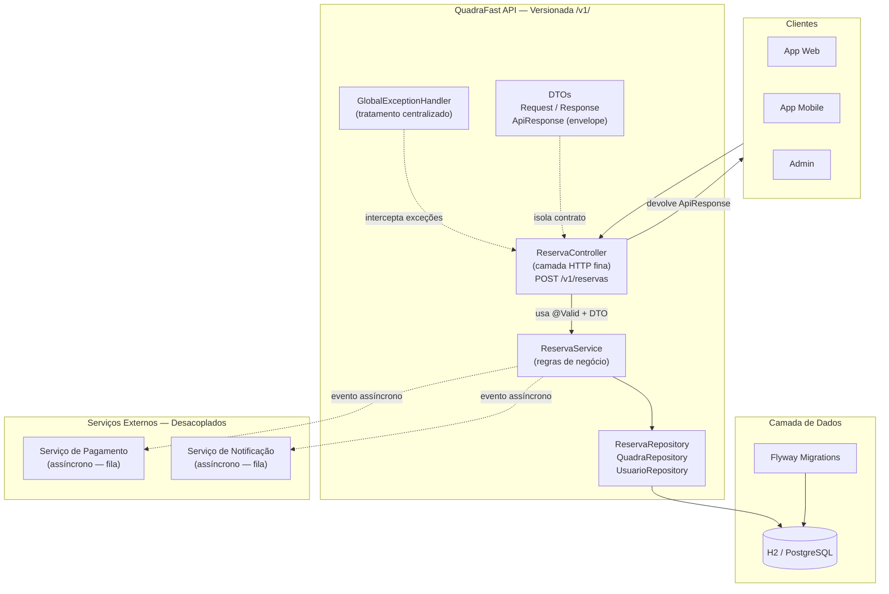

# QuadraFast API — CP3 Diagnóstico Arquitetural

> FIAP · 3ESPR · 2026 · Profa. Damiana Costa

- Rafael De Almeida Sigoli (RM554019)
- Giovanna Franco Gaudino Rodrigues (RM553701)
- Rafael Jorge del Padre (RM552765)

---

## Estrutura do Projeto

```
quadrafast/
├── src/main/java/com/quadrafast/
│   ├── QuadraFastApplication.java
│   ├── controller/
│   │   └── ReservaController.java      ← camada HTTP (fina, sem regra de negócio)
│   ├── service/
│   │   └── ReservaService.java         ← regras de negócio isoladas
│   ├── repository/
│   │   ├── ReservaRepository.java
│   │   ├── QuadraRepository.java
│   │   └── UsuarioRepository.java
│   ├── model/
│   │   ├── Reserva.java
│   │   ├── Quadra.java
│   │   └── Usuario.java
│   ├── dto/
│   │   ├── ReservaDTO.java             ← Request + Response
│   │   └── ApiResponse.java            ← envelope padronizado
│   └── exception/
│       ├── DomainException.java        ← exceções de domínio semânticas
│       └── GlobalExceptionHandler.java ← tratamento centralizado
└── src/main/resources/
    ├── application.properties
    └── db/migration/
        ├── V1__create_tables.sql       ← Flyway migration
        └── V2__seed_data.sql
```

---

## Como executar

```bash
# Pré-requisito: Java 17+ e Maven
mvn spring-boot:run
```

A API sobe em `http://localhost:8080`.  
Console H2 disponível em `http://localhost:8080/h2-console` (JDBC URL: `jdbc:h2:mem:quadrafastdb`).

---

## Parte 1 — Diagnóstico Arquitetural

### Análise do sistema original

A arquitetura atual do QuadraFast foi desenvolvida rapidamente, priorizando entrega sobre qualidade técnica. O resultado é um sistema que funciona em condições normais, mas acumula dívida técnica que compromete manutenção, escalabilidade e segurança.

---

### Problema 1 — Controller Gigante (God Class)

**O que foi encontrado:**  
O `ReservaController` concentra validação de dados, regras de negócio, lógica de segurança e acesso ao banco de dados. Uma única classe faz o que deveria ser responsabilidade de pelo menos três camadas distintas.

**Risco:**  
Qualquer alteração em qualquer parte do fluxo (banco, regra, segurança) exige mexer no mesmo arquivo. O risco de introduzir regressões é altíssimo. Testes unitários tornam-se impossíveis porque não há separação de preocupações.

**Impacto na manutenção e escalabilidade:**  
A equipe não consegue trabalhar em paralelo. Escalar horizontalmente a camada HTTP não resolve gargalos no banco porque tudo está acoplado. A curva de onboarding de novos devs é alta.

---

### Problema 2 — Endpoints não seguem REST

**O que foi encontrado:**  
Endpoints como `/criarReserva` e `/buscarReservas` usam verbos na URL, ferindo o princípio REST de que o verbo HTTP já expressa a ação. O contrato é ambíguo: qual método HTTP usar? Retorna o mesmo status code sempre?

**Risco:**  
Clientes (mobile, parceiros, front-end) não conseguem consumir a API de forma previsível. Integrações quebram facilmente.

**Impacto:**  
Impossibilidade de usar cache HTTP padrão. Dificuldade de documentar com OpenAPI/Swagger. Retrabalho ao integrar novos consumidores.

---

### Problema 3 — Entidade JPA exposta diretamente (ausência de DTOs)

**O que foi encontrado:**  
As entidades JPA (`@Entity`) são serializadas diretamente nas respostas HTTP. Campos internos como `criadoEm`, `id` gerado, relacionamentos lazy e anotações de persistência ficam expostos.

**Risco:**  
- Vazamento de dados internos do banco para clientes externos  
- Serialização circular (relacionamentos bidirecionais causam stack overflow)  
- Qualquer refatoração no modelo quebra automaticamente o contrato da API

**Impacto:**  
Impossibilidade de evoluir o modelo de dados sem quebrar consumidores.

---

### Problema 4 — Ausência de tratamento padronizado de erros

**O que foi encontrado:**  
Erros são tratados com `if/else` espalhados pelo código, e exceções Java puras chegam ao cliente (stack trace, mensagens internas). Cada endpoint retorna formatos diferentes de erro.

**Risco:**  
- Exposição de informações internas (stack trace = vetor de ataque)  
- Clientes não conseguem tratar erros programaticamente  
- Comportamento inconsistente entre endpoints

**Impacto:**  
Impossibilidade de construir um front-end robusto. Clientes precisam de tratamentos específicos por endpoint.

---

### Problema 5 — Alto acoplamento com serviços externos (chamadas síncronas)

**O que foi encontrado:**  
O `ReservaService` chama o serviço de Pagamento e o serviço de Notificação de forma síncrona e obrigatória. Se o serviço de notificação estiver fora, a reserva não é criada.

**Risco:**  
- Cascata de falhas: uma dependência indisponível derruba o fluxo principal  
- Latência multiplicada (3 chamadas síncronas = soma dos tempos)  
- Impossibilidade de escalar serviços independentemente

**Impacto:**  
Disponibilidade do sistema de reservas é determinada pelo serviço mais fraco da cadeia.

---

### Problema 6 — Banco alterado manualmente (ausência de migrations)

**O que foi encontrado:**  
O schema do banco é alterado diretamente em produção, sem controle de versão. Não existe histórico de alterações, nem processo de rollback.

**Risco:**  
- Ambientes (dev, staging, prod) ficam dessincronizados  
- Não há como rastrear quem alterou o quê e quando  
- Deploy em novo ambiente exige conhecimento manual do DBA

**Impacto:**  
Qualquer desenvolvedor novo não consegue replicar o ambiente. Rollback de releases é inviável.

---

### Problema 7 — Sem observabilidade

**O que foi encontrado:**  
Logs simples sem correlation-id. Não é possível rastrear uma requisição do início ao fim, especialmente quando ela passa por múltiplos serviços.

**Risco:**  
- Debugging em produção é praticamente impossível  
- Incidentes demoram muito mais para ser diagnosticados

**Impacto:**  
MTTR (Mean Time To Recover) altíssimo. Impossibilidade de SLA confiável.

---

### Problema 8 — Ausência de versionamento da API

**O que foi encontrado:**  
A API não possui versão na URL (ex: `/v1/`). Qualquer mudança de contrato quebra todos os consumidores simultaneamente.

**Risco:**  
- Impossibilidade de evoluir a API sem breaking changes  
- Clientes não conseguem migrar no próprio ritmo

**Impacto:**  
Freezing de funcionalidades: a equipe evita mudar a API por medo de quebrar integrações.

---

## Parte 2 — Proposta de Solução

### Diagrama da Arquitetura Proposta



### Decisões Arquiteturais

**Separação em camadas:**  
- **Controller** → só HTTP: receber, delegar, responder  
- **Service** → só negócio: validações, regras, orquestração  
- **Repository** → só dados: queries, persistência  
- **DTO** → só contrato: o que entra e o que sai da API

**Versionamento:**  
Todos os endpoints sob `/v1/`. Versões futuras (`/v2/`) coexistem sem breaking changes.

**DTOs:**  
`ReservaDTO.Request` valida a entrada com Bean Validation. `ReservaDTO.Response` controla exatamente o que o cliente vê. A entidade JPA nunca é serializada diretamente.

**Envelope padronizado:**  
Toda resposta usa `ApiResponse<T>` com campos `sucesso`, `mensagem`, `dados`, `erros` e `timestamp`. O cliente sempre sabe o que esperar.

**Tratamento de erros:**  
`GlobalExceptionHandler` com `@RestControllerAdvice` intercepta todas as exceções. Cada tipo de erro tem um HTTP status semântico. Stack traces nunca chegam ao cliente.

**Migrations:**  
Flyway gerencia todas as alterações de schema. `V1__create_tables.sql`, `V2__seed_data.sql`... cada mudança é um arquivo versionado, rastreável e executado automaticamente.

**Desacoplamento de serviços externos:**  
Pagamento e Notificação são chamados de forma assíncrona (fila de mensagens). A reserva é confirmada imediatamente; as integrações acontecem em background. Falha numa integração não derruba o fluxo principal.

---

## Parte 3 — Endpoint Implementado

### `POST /v1/reservas`

**Fluxo de execução:**

```
Request HTTP
    → ReservaController (@Valid valida DTO)
        → ReservaService
            1. findById(quadraId)    → 404 se não existir
            2. quadra.getAtiva()     → 422 se inativa
            3. findById(usuarioId)   → 404 se não existir
            4. existeConflito(...)   → 409 se sobrepõe horário existente
            5. reservaRepository.save(reserva)
        → ReservaDTO.Response.from(reserva)
    → ApiResponse.sucesso(201)
```

### Exemplos de requisição e resposta

**Sucesso — 201 Created:**
```json
// POST /v1/reservas
{
  "quadraId": 1,
  "usuarioId": 1,
  "dataHoraInicio": "2026-06-01T10:00:00",
  "dataHoraFim":    "2026-06-01T12:00:00"
}

// Resposta
{
  "sucesso": true,
  "mensagem": "Reserva criada com sucesso.",
  "dados": {
    "id": 1,
    "quadraId": 1,
    "quadraNome": "Quadra A",
    "usuarioId": 1,
    "usuarioNome": "João Silva",
    "dataHoraInicio": "2026-06-01T10:00:00",
    "dataHoraFim":    "2026-06-01T12:00:00",
    "status": "CONFIRMADA",
    "criadoEm": "2026-05-21T21:30:00"
  },
  "timestamp": "2026-05-21T21:30:00"
}
```

**Quadra inexistente — 404 Not Found:**
```json
{
  "sucesso": false,
  "mensagem": "Quadra com id 999 não encontrada.",
  "timestamp": "2026-05-21T21:30:00"
}
```

**Conflito de horário — 409 Conflict:**
```json
{
  "sucesso": false,
  "mensagem": "Já existe uma reserva confirmada para essa quadra no horário solicitado.",
  "timestamp": "2026-05-21T21:30:00"
}
```

**Dados inválidos — 400 Bad Request:**
```json
{
  "sucesso": false,
  "mensagem": "Dados de entrada inválidos.",
  "erros": [
    "quadraId: quadraId é obrigatório.",
    "dataHoraInicio: dataHoraInicio deve ser uma data futura."
  ],
  "timestamp": "2026-05-21T21:30:00"
}
```

---

## Perguntas Discursivas

### 1. Por que APIs REST devem possuir contratos padronizados?

Um contrato padronizado é o acordo entre a API e seus consumidores. Quando todos os endpoints seguem a mesma estrutura de resposta mesmo formato de campos, mesmos tipos de dados, mesmo comportamento em erros  os clientes conseguem integrar de forma previsível e escrever código genérico que funciona para qualquer endpoint.

Sem padronização, cada endpoint vira um caso especial: o front-end precisa de tratamentos específicos por rota, o time de QA não consegue automatizar testes de forma abrangente, e qualquer novo consumidor da API enfrenta uma curva de aprendizado elevada. A padronização reduz acoplamento cognitivo, facilita a geração automática de documentação (OpenAPI/Swagger) e diminui drasticamente o número de bugs de integração.

No QuadraFast, adotamos o envelope `ApiResponse<T>` que garante: todo sucesso tem `sucesso: true` + `dados`; todo erro tem `sucesso: false` + `mensagem` + `erros` opcionais. O cliente nunca precisa adivinhar o formato.

---

### 2. Qual a importância do uso de DTOs em APIs modernas?

DTO (Data Transfer Object) é o objeto que define exatamente o que entra e o que sai de uma API, sem ser a entidade de domínio. Sua importância está em três pilares:

**Segurança:** sem DTOs, campos internos como senhas, tokens ou dados sensíveis podem ser expostos acidentalmente. Com DTOs, o desenvolvedor declara explicitamente cada campo que o cliente pode ver.

**Estabilidade do contrato:** o modelo de dados interno muda com frequência (novos índices, renomear colunas, adicionar campos de auditoria). Com DTOs, essas mudanças são invisíveis para o cliente enquanto o DTO permanecer igual.

**Validação centralizada:** o DTO de entrada (`Request`) é o lugar natural para as anotações de validação (`@NotNull`, `@Future`, `@Size`). A entidade JPA não precisa carregar essa responsabilidade.

No projeto, `ReservaDTO.Request` valida os dados de entrada e `ReservaDTO.Response` controla a saída  a entidade `Reserva` nunca é serializada diretamente.

---

### 3. O que é acoplamento arquitetural e quais impactos ele pode causar?

Acoplamento arquitetural ocorre quando componentes de um sistema dependem diretamente de detalhes de implementação uns dos outros, em vez de depender de abstrações. Quanto maior o acoplamento, mais difícil é modificar qualquer parte sem afetar as demais.

No QuadraFast original, o controller acessava o banco diretamente, o service conhecia detalhes HTTP, e os serviços externos eram chamados de forma síncrona dentro do fluxo principal. Isso cria uma teia de dependências onde mudar qualquer componente propaga efeitos colaterais imprevisíveis.

Os impactos concretos são: impossibilidade de testar componentes de forma isolada (um teste de regra de negócio precisa de banco de dados real); impossibilidade de escalar componentes independentemente (não dá para escalar só a camada de negócio); tempo de build e deploy mais alto porque mudanças pequenas exigem recompilação de módulos não relacionados; e dificuldade de onboarding, pois a equipe precisa entender o sistema inteiro para fazer qualquer mudança.

A solução é o princípio da inversão de dependência: componentes devem depender de interfaces e abstrações, não de implementações concretas.

---

### 4. Explique a importância do versionamento de APIs.

O versionamento de APIs é o mecanismo que permite evoluir uma API sem forçar todos os consumidores a atualizarem ao mesmo tempo. Sem versionamento, qualquer mudança de contrato  renomear um campo, remover um endpoint, mudar o formato de uma data  é um breaking change que afeta todos os clientes simultaneamente.

Com versionamento (ex: `/v1/reservas`, `/v2/reservas`), a equipe pode lançar uma nova versão com melhorias enquanto a versão anterior continua funcionando. Os consumidores migram no próprio ritmo. O time de produto pode inovar sem medo de quebrar integrações existentes.

O versionamento também facilita a comunicação de depreciação: é possível anunciar que `/v1/` será descontinuada em 6 meses, dando tempo hábil para migração. Sem versionamento, a opção é ou congelar a API para sempre, ou quebrar todos os clientes de uma vez.

---

### 5. Por que migrations são importantes em aplicações modernas?

Migrations são arquivos que descrevem de forma incremental e versionada todas as alterações no schema do banco de dados. Ferramentas como Flyway ou Liquibase executam essas alterações de forma ordenada e rastreável.

A importância está na rastreabilidade e reprodutibilidade: qualquer desenvolvedor que clonar o repositório consegue subir o banco no estado exato de produção simplesmente rodando a aplicação. Não existe mais o problema de "na minha máquina funciona" causado por diferenças de schema.

Sem migrations, alterações são feitas manualmente em produção (risco de erro humano), os ambientes ficam dessincronizados (dev ≠ staging ≠ prod), não há histórico de quem alterou o quê, e rollback de releases com alterações de banco torna-se uma operação arriscada e manual.

Com Flyway, cada `V{número}__descricao.sql` é executado uma única vez, em ordem, e registrado na tabela `flyway_schema_history`. O pipeline de CI/CD pode aplicar migrations automaticamente antes de subir a nova versão da aplicação, garantindo que banco e código estejam sempre sincronizados.

---

## Tecnologias utilizadas

| Tecnologia | Versão | Papel |
|---|---|---|
| Java | 17 | Linguagem |
| Spring Boot | 3.2.5 | Framework principal |
| Spring Web | — | Camada HTTP / REST |
| Spring Data JPA | — | Repositórios |
| Bean Validation | — | Validação de DTOs |
| H2 Database | — | Banco em memória |
| Flyway | — | Migrations |
| Lombok | — | Redução de boilerplate |
| JUnit 5 + MockMvc |  | Testes de integração |
